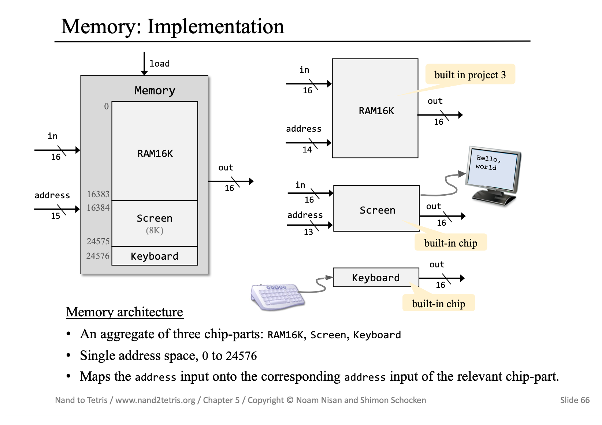

## CPU Implementation


From left to right, the first Mux16 control bit is instruction[15] which is a op code whose value tell if it is a A instruction(0) or a C instruction(1). The A instruction contains a value that will be used by CPU, The C instruction contains the control bits that will be used by CPU.If it is a A instruction then it's simple, the instruction[0..14] is just a value which will be then write to adreessM and PC. If it is a  C instruction then there is a lot of more thing to deal with. The structure of C instruction  was shown as following.


The 'a' bit of C instruction is the control bit of the second Mux16 , when it is 0 it select the output of A , when it is 1 it select the output of memery(inM). The six comp bit in C instruction have the same mean as the six control bit in ALU(Arithmetic Logic Unit). The Result of ALU calculation fed simultaneously to D-register, A-register, data memory. The  instruction's three dest-bits were the control bits of  three unit respectively, which control whether the unit will receive the ALU's output or keep the original value. In the end , the PC will determinate which instruction to execute next. It combine the jumpbits of C instruction and the zr ng output of ALU to to determine whether to jump to some other instruction or just increment the curent counter.


## Memory Implementation

As the following picture show, the memory has three part , RAM, Screen, Keyboard, having of size 16k, 8K, 16bit respectively. The RAM's address starts from 0 to 16383, The Screen's address starts from 16384 to 24575, The Keyboard's addree was 24576, Shown in binary formats as following.

```
000000000000000
	RAM
011111111111111

100000000000000
  Screen
101111111111111

110000000000000  Keyboard
```

As you can see the high 2 bit can be used to distinguish the three kind of memory, the RAM's high  2 bits were 00 and 01, the Screen's high 2 bits were 10 and Keyboard's high 2 bits were 11. So that, I can used the DMux4Way and Mux4Way units to select the correct memory unit. 



## Computer Implementation

As I have finished implementing of The CPU and Memory, The Computer Implementation was simple, as the following picture show.


